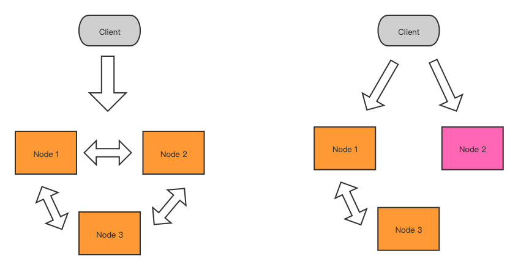

# CAP理论内容

一个分布式系统，不可能同时满足下面三个特性：

* ***数据一致性 Consistency***
* ***可用性 Availability***
* ***分区容错性 Partition tolerance***

## 数据一致性 Consistency

系统中对数据的操作就是读、写两种，其中写操作又分为增、删、改查，而写操作将导致数据的变化。在分布式系统中，读操作在任意节点读取的数据变化都是一致的，就达到了数据一致性。

## 可用性 Availability

分布式系统中的可用性包含两个方面的，首先是响应时间上满足要求，在期望的时间内能够得到正确的响应结果，其次当系统发生错误时，也能给出适当的响应结果。

## 分区容错性 Partition tolerance

当节点之间的通信中断，分布式系统整体上仍然能够正常提供服务。

# CAP理论的由来

MIT教授Lynch在1985年发表了一篇论文『Impossibility of Distributed Consensus with One Faulty Process』，证明了如果在一个不稳定（消息要么乱序要么丢了）的网络环境里（分布式异步模型），想始终保持数据一致是不可能的。

2000年，Eric Brewer教授	提出CAP理论（猜想）

2002年后，Seth Gilbert 、Nancy Lynch 证明CAP 猜想

# CAP理论应用

## 分布式里的CAP

分布式系统可以***提高系统的可用性***，非分布式系统容易形成单点故障导致整个系统不可用。分布式系统中，当某个节点发生故障时，其它节点可以代替它正常提供服务，从而保障系统可用性。

由于采用了分布式架构，节点之间必然需要相互之间进行通信，现实中由于受各种因素的影响，节点之间的通信有可能中断从而发生分区的情况，要提高系统可用性，必须要提供分区容错性，也就是当发生分区问题时，系统仍然能够正常响应。***分区容错性是分布式系统里必须要保证提供的特性，否则数据一致性和可用性都无法保障。***

在保证了分区容错性的前提下，是否可以同时保证数据一致性和可用性呢？我的答案是可以，但是可以达到的程度不同。

CAP理论只是一种数学上的理论推导，并未准确定义数据一致性与可用性，而且实际的工程操作中往往无法在这两点上做到100%，在未发生分区的情况下，我们可以不断的追求更高的可用性和数据一致性。

在支付类的系统中通常采用强一致性方案，此时需要花更多的成本在节点间做数据同步，系统的响应时间可能就更长导致可用性下降，但仍然在可接受范围内。再比如有些系统会采用最终一致性方案，数据的同步会有一定的延迟，但是可以更快的给出响应，可用性非常高。

在发生了分区的情况下，节点之间的通信中断，则数据同步会受到影响，进而导致节点间出现数据不一致，为了保证数据的一致性，只能是花更多的时间和成本去做数据同步，甚至直到操作超时也无法完成数据同步，此时系统的可用性就会下降，出现操作超时或异常错误；如果要保证高可用，只能是接受数据的不一致或最终一致。

分布式系统的架构设计就是在数据一致性和可用性之间进行权衡，做出妥协。

## ZK里的CAP

